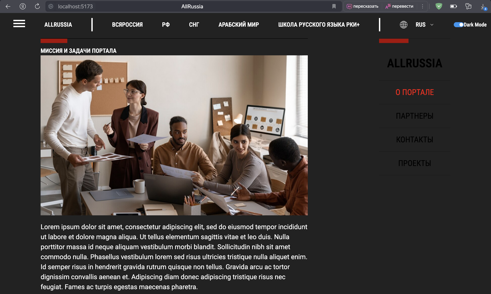
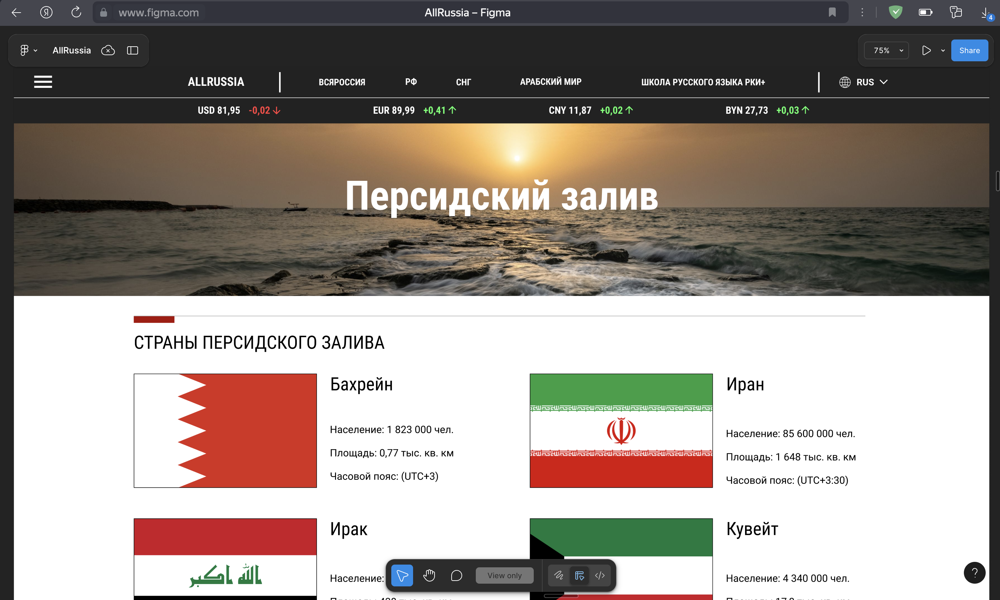
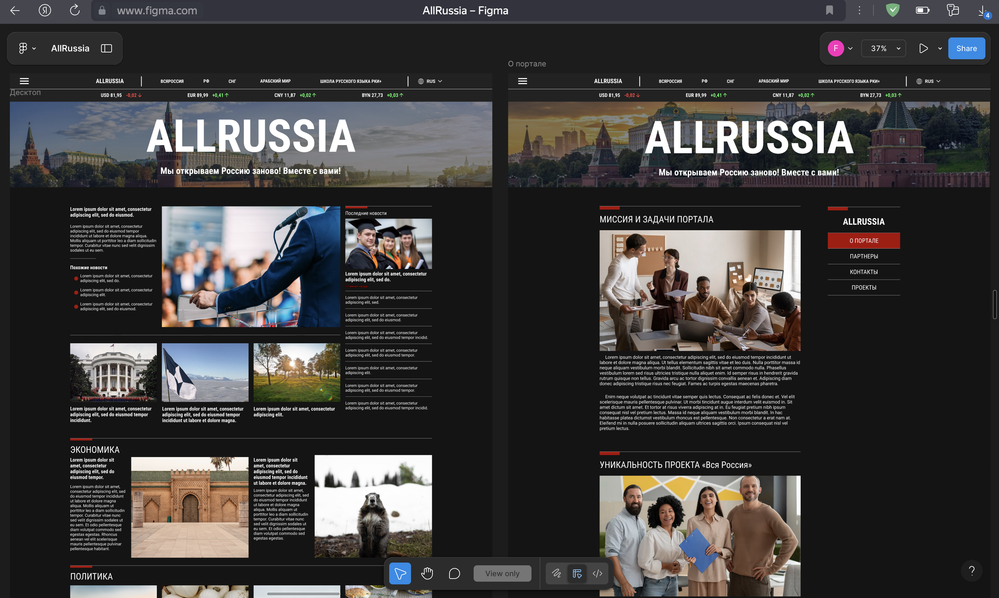

# Журнал проекта

## 20.02.2025 — Создание тёмной темы

Была реализована полноценная тёмная тема сайта для комфортного восприятия информации в условиях низкой освещённости.

## 23.02.2025 — Страница "Персидский залив"

Создана отдельная страница для освещения событий в регионе Персидского залива.

## 10.03.2025 — Добавление флагов

Флаги были добавлены на все округа в соответствии с выбранным языком отображения.

## 07.04.2025 — Обновление header

Главное изображение сайта было заменено на более современное и привлекательное.

## 28.04.2025 — Исправление ошибок

Внесены многочисленные исправления вёрстки и логики работы компонентов.
